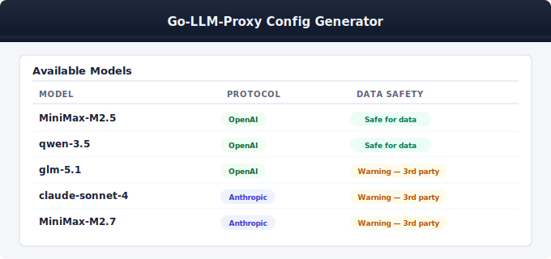
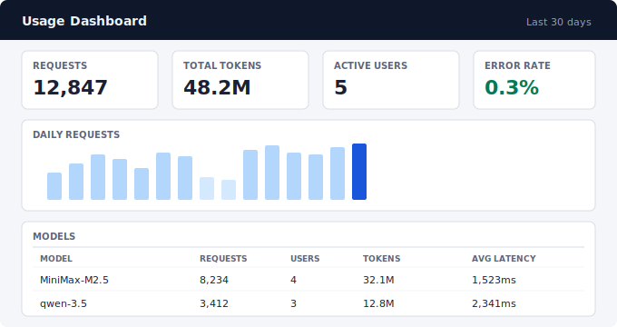

# go-llm-proxy

A lightweight LLM API proxy that aggregates multiple backends (vLLM, llama-server, cloud APIs) behind a single endpoint. Single binary, YAML config, no external dependencies.

Combine locally hosted models with cloud subscriptions on one endpoint. Switch models by name, control access per API key, and connect any OpenAI or Anthropic-compatible client.

## Quick Start

**Docker:**

```bash
cp config.yaml.example config.yaml
# edit config.yaml with your models and keys
docker run --rm -p 8080:8080 \
  -v $(pwd)/config.yaml:/config/config.yaml:ro \
  ghcr.io/yatesdr/go-llm-proxy:latest
```

**Binary** ([download](https://github.com/yatesdr/go-llm-proxy/releases)):

```bash
cp config.yaml.example config.yaml
# edit config.yaml with your models and keys
./go-llm-proxy -config ./config.yaml
```

## Minimum config

```yaml
listen: ":8080"

models:
  - name: my-model
    backend: http://192.168.1.10:8000/v1

keys:
  - key: sk-your-secret-key
    name: admin
```

That's it — one model, one key. See [config reference](doc/config-reference.md) for all options.

## Features

- OpenAI and Anthropic API passthrough (chat, completions, embeddings, images, audio, messages)
- Anthropic Messages API translation — use Claude Code with any Chat Completions backend
- OpenAI Responses API translation — use Codex CLI with any Chat Completions backend
- Model name routing and rewriting across backends
- API key auth with per-key model access control
- Streaming (SSE) support with proper flush handling
- Context window auto-detection from backends
- Per-request usage logging with web dashboard and CLI reports
- Hot-reload config on file change + `SIGHUP`
- Hardened for public internet exposure

## Supported endpoints

| Endpoint | Description |
|----------|-------------|
| `GET /v1/models` | Aggregated model list |
| `POST /v1/chat/completions` | Chat completions (streaming supported) |
| `POST /v1/completions` | Text completions |
| `POST /v1/embeddings` | Embeddings |
| `POST /v1/images/generations` | Image generation |
| `POST /v1/audio/*` | Speech-to-text, translation, TTS |
| `POST /v1/responses` | Responses API (native or translated) |
| `POST /v1/responses/compact` | Context compaction |
| `POST /v1/messages` | Anthropic Messages API (native or translated — see [Claude Code guide](doc/claude-code.md)) |
| `POST /anthropic/v1/messages` | Anthropic Messages (explicit prefix, validates backend type) |

## Config generator

The built-in config generator (`--serve-config-generator`) creates ready-to-use configs for popular coding assistants.



Select a tool, choose your models, and generate a config file or start script:

| Tool | Guide |
|------|-------|
| Codex CLI | [doc/codex.md](doc/codex.md) |
| Claude Code | [doc/claude-code.md](doc/claude-code.md) |
| OpenCode | [doc/opencode.md](doc/opencode.md) |
| Qwen Code | [doc/qwen-code.md](doc/qwen-code.md) |

## Usage monitoring

Track requests, tokens, and latency per user and model with built-in logging and a web dashboard.



Enable with `log_metrics: true` and `usage_dashboard: true` in config. See [usage docs](doc/usage.md) for details.

## Documentation

| Topic | Link |
|-------|------|
| Configuration reference | [doc/config-reference.md](doc/config-reference.md) |
| Codex CLI / Responses API | [doc/codex.md](doc/codex.md) |
| Claude Code | [doc/claude-code.md](doc/claude-code.md) |
| OpenCode | [doc/opencode.md](doc/opencode.md) |
| Qwen Code | [doc/qwen-code.md](doc/qwen-code.md) |
| Usage logging and dashboard | [doc/usage.md](doc/usage.md) |
| Deployment (systemd, nginx) | [doc/deployment.md](doc/deployment.md) |
| Docker | [doc/docker.md](doc/docker.md) |
| Security | [doc/security.md](doc/security.md) |
