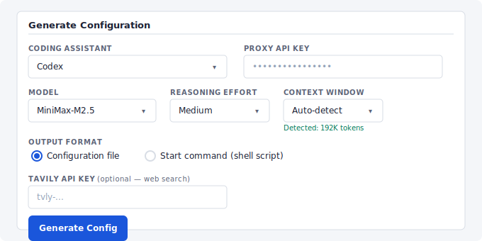

# Codex CLI / Responses API

go-llm-proxy supports OpenAI's [Codex CLI](https://github.com/openai/codex) and any other client that uses the Responses API (`POST /v1/responses`). This works with both native Responses API backends (OpenAI, Azure OpenAI) and backends that only support Chat Completions (vLLM, llama-server, etc.).

## Quick start

The easiest path is the built-in config generator (`--serve-config-generator` flag). Select **Codex** from the coding assistant dropdown, pick your model, and it generates either:

- **Configuration file** — a `config.toml` to save as `~/.codex/config.toml`
- **Start command** — a shell script that passes all settings via `codex -c` overrides, requiring no config file changes



For manual setup, see [Manual configuration](#manual-configuration) below.

## How it works

The proxy auto-detects whether each backend supports the Responses API natively:

1. **First request**: the proxy forwards the Responses API request directly to the backend.
2. **Backend returns 200**: the response is streamed through transparently. The backend is cached as native.
3. **Backend returns 404**: the proxy falls back to Chat Completions translation and caches the result. All subsequent requests skip the probe.

This means:
- **OpenAI, Azure OpenAI** and other native backends work at full fidelity — encrypted compaction, built-in tools, reasoning tokens, everything passes through untouched.
- **vLLM, llama-server, Ollama** and other Chat Completions backends get automatic translation — the proxy converts Responses API requests to Chat Completions and translates the streaming response back.

The detection happens once per backend URL and endpoint path (so a backend that supports `/responses` but not `/responses/compact` is handled correctly). Results are cached for the lifetime of the proxy process.

### `responses_mode`

Control how the proxy handles Responses API requests per model:

| Value | Behavior |
|---|---|
| `auto` | Default. Probe backend on first request, cache the result, fall back to translation if 404. |
| `native` | Always passthrough. Never translate. Use for backends you know support `/v1/responses`. |
| `translate` | Always translate to Chat Completions. Skip the probe entirely. |

```yaml
models:
  # Auto-detect (default — omit responses_mode or set to "auto"):
  - name: qwen-3.5
    backend: http://192.168.13.30:8000/v1

  # Force translation (skip probe for backends you know are Chat Completions only):
  - name: MiniMax-M2.5
    backend: http://192.168.100.10:8000/v1
    responses_mode: translate

  # Force native passthrough (for OpenAI or backends with full Responses API):
  - name: gpt-4.1
    backend: https://api.openai.com/v1
    responses_mode: native
```

In `auto` mode, the one-time probe adds a single round-trip on the first request per backend. Use `translate` to avoid it for backends you know are Chat Completions only, or `native` to skip it for backends you know support the Responses API.

## Translation details

When translating for non-native backends, the proxy maps between the two API formats:

### Request translation (Responses -> Chat Completions)

| Responses API | Chat Completions |
|---|---|
| `input` (string) | Single user message |
| `input` (array of items) | Messages array (see below) |
| `instructions` | System message (prepended) |
| `tools` (function type) | `tools` with nested `function` wrapper |
| `tool_choice` | `tool_choice` (pass through) |
| `max_output_tokens` | `max_completion_tokens` |
| `reasoning.effort` | `reasoning_effort` |
| `text.format` | `response_format` |
| `temperature`, `top_p`, `user` | Pass through |

Input item type mapping:

| Responses input item | Chat Completions message |
|---|---|
| `{role: "user", content: "..."}` | `{role: "user", content: "..."}` |
| `{role: "developer", content: "..."}` | `{role: "system", content: "..."}` |
| `{type: "message", role: "assistant", content: [...]}` | `{role: "assistant", content: "..."}` |
| `{type: "function_call", call_id, name, arguments}` | Merged into assistant message `tool_calls` |
| `{type: "function_call_output", call_id, output}` | `{role: "tool", tool_call_id, content}` |
| `{type: "reasoning", ...}` | Dropped (no equivalent) |
| `{type: "compaction", ...}` | Dropped (no equivalent) |

Non-function tool definitions (`web_search_preview`, `code_interpreter`, etc.) are dropped since Chat Completions backends cannot execute them. Codex sends `local_shell_call` and `custom_tool_call` as function-type tools, so they translate normally.

### Response translation (Chat Completions -> Responses)

Streaming responses are translated event-by-event:

| Chat Completions chunk | Responses API event |
|---|---|
| First chunk with `delta.role` | `response.created`, `output_item.added`, `content_part.added` |
| `delta.content` | `response.output_text.delta` |
| `delta.tool_calls[i]` with `id` | `response.output_item.added` (function_call) |
| `delta.tool_calls[i].function.arguments` | `response.function_call_arguments.delta` |
| `finish_reason: "stop"` | All `*.done` events, `response.completed` |
| `finish_reason: "tool_calls"` | Tool call `*.done` events, `response.completed` |
| `finish_reason: "length"` | `response.incomplete` |
| Usage chunk | Included in `response.completed` |

Non-streaming responses are translated as a single JSON object.

## Context compaction

Long Codex sessions may trigger context compaction to manage the growing conversation history.

**Native backends**: The `/v1/responses/compact` request is passed through directly, preserving OpenAI's encrypted compaction format.

**Translated backends**: The proxy sends the conversation to the backend with a summarization prompt and returns the result as preserved user messages plus a summary assistant message. This is functionally similar to Codex's own inline compaction path for non-OpenAI providers.

**Note**: When using the config generator's custom provider setup (`model_provider = "go-llm-proxy"`), Codex automatically uses its client-side inline compaction, which goes through the regular `/v1/responses` endpoint. The `/v1/responses/compact` handler serves as a fallback for alternative configurations.

## Web search

Codex's built-in `web_search_preview` tool is a server-side OpenAI feature. It works with native OpenAI backends but not with local models directly.

The proxy can handle web search transparently for local models:

**Option 1: Proxy-side search (recommended)** — Configure a Tavily API key in the proxy's `processors` block:

```yaml
processors:
  web_search_key: tvly-your-key
```

The proxy automatically converts Codex's `web_search_preview` tool to a function tool. When the backend model calls `web_search`, the proxy executes a Tavily search and injects the results. Codex sees only the final response. No client-side configuration needed — the config generator omits MCP setup when the proxy has search configured.

**Option 2: Client-side MCP** — For local/proxy models, the config generator disables the built-in search (`web_search = "disabled"`) and optionally configures [Tavily](https://tavily.com/) as an MCP server. Enter your Tavily API key in the config generator to include it.

The generated TOML includes:

```toml
web_search = "disabled"

[mcp_servers.tavily]
url = "https://mcp.tavily.com/mcp"
bearer_token_env_var = "TAVILY_API_KEY"
```

Set the environment variable before running Codex:

```bash
export TAVILY_API_KEY=tvly-your-key
```

## Manual configuration

If you prefer not to use the config generator, create `~/.codex/config.toml`:

```toml
model = "your-model-name"
model_provider = "go-llm-proxy"
model_reasoning_effort = "medium"
web_search = "disabled"

[model_providers.go-llm-proxy]
name = "Go-LLM-Proxy"
base_url = "http://your-proxy-host:8080/v1"
env_key = "OPENAI_API_KEY"
wire_api = "responses"
```

Then set your proxy API key:

```bash
export OPENAI_API_KEY=your-proxy-api-key
```

### Key fields

| Field | Purpose |
|---|---|
| `model_provider` | Must match the name in `[model_providers.*]` |
| `base_url` | Your proxy URL including `/v1` |
| `env_key` | Name of the env var holding the API key |
| `wire_api = "responses"` | Tells Codex to use the Responses API (required) |
| `model_reasoning_effort` | `"low"`, `"medium"`, or `"high"` |
| `web_search` | Set to `"disabled"` for non-OpenAI backends |

## Context window

Codex uses the model's context window size to manage conversation history and trigger compaction. The proxy auto-detects this from each backend at startup:

- **vLLM backends**: reads `max_model_len` from `GET /v1/models`
- **llama-server backends**: reads `meta.n_ctx_train` from `GET /v1/models`
- **Anthropic backends**: reads `max_input_tokens` from `GET /v1/models/{model_id}`
- **Cloud APIs without a models endpoint** (e.g., MiniMax cloud, Zhipu): detection fails gracefully — a warning is logged

Detection runs asynchronously at startup and does not block the server. Results are cached and served through the proxy's `/v1/models` endpoint in the `max_model_len` field.

### Manual override

For backends that don't report their context window, set it explicitly in `config.yaml`:

```yaml
- name: MiniMax-M2.7
  backend: https://api.minimax.io/anthropic
  type: anthropic
  context_window: 1048576   # 1M tokens
```

Omit the field or set it to `0` for auto-detection. Any positive value skips the backend query and uses the configured value directly.

### Config generator

The Codex config generator includes a **Context Window** dropdown. When the selected model has a detected context window, the hint shows the value (e.g., "Detected: 192K tokens"). When detection returned nothing, the dropdown is highlighted amber with "Not detected — set manually for best results" to prompt manual selection. The chosen value is included as `model_context_window` in the generated Codex config.

## Known limitations

These limitations apply only to **translated backends** (Chat Completions). Native passthrough backends (OpenAI, Azure OpenAI, or any backend that supports `/v1/responses`) have full fidelity — the proxy is transparent and all Responses API features work exactly as they would with a direct connection.

### Translation scope

The translation layer targets **Codex CLI and coding-agent workflows**: text generation, function calling, and tool use. It is not a spec-complete generic Responses API adapter. Specifically:

- **Non-function tools are converted or dropped.** `web_search_preview` is converted to a proxy-side function tool when `web_search_key` is configured in the `processors` block (the proxy executes Tavily searches transparently). Other server-side tools (`code_interpreter`, `file_search`) are dropped since Chat Completions backends cannot execute them.
- **Some input item types are dropped.** `reasoning`, `compaction`, `tool_search_call`, `web_search_call`, and `image_generation_call` items in conversation history are skipped during translation since they have no Chat Completions equivalent. These are either Codex-internal state or server-side features. This does not affect normal conversation flow — Codex handles their absence gracefully.
- **Assistant content is simplified.** Structured content arrays on assistant messages are reduced to concatenated text from `output_text` parts. Other content types (e.g., images from `image_generation_call`) are not preserved through translation.
- **Encrypted compaction is not available.** The summarization fallback preserves conversation context but is not protocol-equivalent to OpenAI's encrypted compaction.

### Backend compatibility

The translated Chat Completions output uses standard fields (`messages`, `tools`, `stream`, `max_completion_tokens`, `reasoning_effort`, `response_format`, etc.). Compatibility depends on what each backend supports:

- **vLLM** has comprehensive Chat Completions support including tool calling, `response_format`, and `max_completion_tokens`. Recent versions expose `/v1/responses` but multi-turn input validation may not be fully compatible with Codex. **Recommend `responses_mode: translate` for vLLM** unless you have explicitly validated your version with Codex end-to-end.
- **llama-server** (llama.cpp) supports core Chat Completions (`/v1/chat/completions`) but feature coverage varies by version — `response_format`, `parallel_tool_calls`, and reasoning-related fields may not be available in older builds. Test with your version.
- **Ollama** supports basic Chat Completions. Tool calling support varies.

The proxy only includes optional fields (like `response_format` or `reasoning_effort`) when the Codex client sends them, so a basic session will work with minimal backend support.

### Other limitations

- **Token counts are not available for native passthrough.** Usage logging records request/response byte counts but not token counts for passthrough requests (tokens would require buffering and parsing the full response).
- **WebSocket transport is not supported.** Codex falls back to HTTP SSE automatically, which the proxy supports fully.

## Proxy-side configuration

On the proxy side, no special configuration is needed. Any OpenAI-type model in your `config.yaml` is automatically available via the Responses API. The proxy handles detection and translation transparently.

The only proxy-side option is `responses_mode` on a model, which controls whether the proxy probes, passthroughs, or translates Responses API requests. See [`responses_mode`](#responses_mode) above for details.
